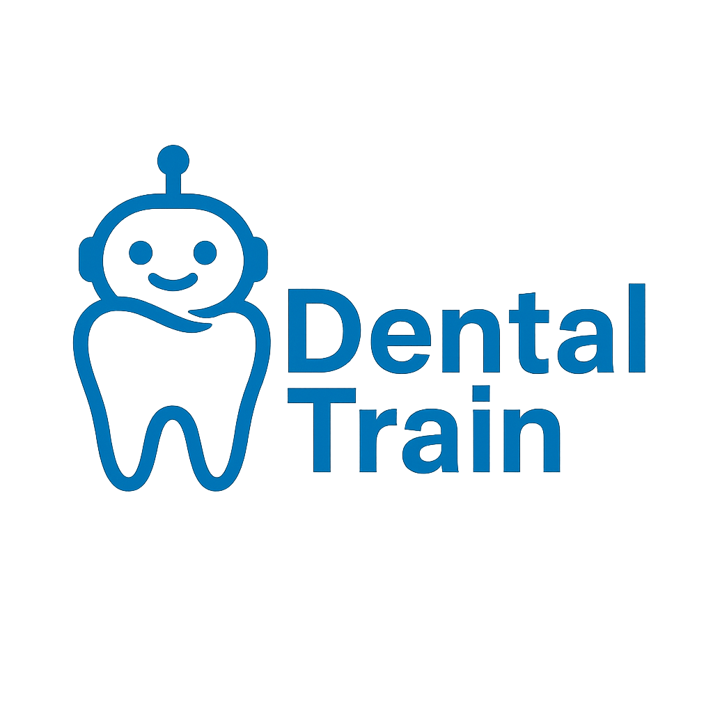

# DentalTrain: An Intelligent Virtual Patient Simulator for Endodontic Clinical Training

  

# *DentalTrain (Ex-DentalSim)*

**Aplicația poate fi accesată aici:** [DentalTrain-App](https://scs.ubbcluj.ro/aiinference/4)

## Echipa

- Magui Anca Elena
- Mera Maria Mădălina
- Moga Antonia Teodora

## **Context educațional și problemă**

Formarea competențelor clinice în stomatologie depinde în mod fundamental de expunerea repetată la pacienți reali. În practică, această expunere este limitată de numărul redus de cazuri disponibile, varietatea scăzută a patologiilor întâlnite într-o perioadă scurtă, presiunea mediului clinic și teama de a greși. Tranziția de la cunoașterea teoretică la raționamentul clinic aplicat este lentă și adesea dificilă, deoarece studenții trebuie să învețe simultan anamneza, comunicarea cu pacientul, extragerea informațiilor relevante, formularea ipotezelor diagnostice și deciziile terapeutice.

În lipsa unui mediu de antrenament sigur și repetabil, dezvoltarea acestor competențe se fragmentează, iar încrederea profesională apare târziu, de multe ori după primul contact cu pacienți reali. Spațiul educațional actual necesită instrumente interactive care să permită exersarea sistematică, variată și lipsită de risc.

La această problemă se adaugă și existența limitată a pacienților disponibili pentru instruire, precum și faptul că multe cazuri rare nu sunt întâlnite suficient de des în timpul stagiilor clinice. Metodele tradiționale nu oferă studenților expunerea necesară pentru a acumula experiență practică reală și nu acoperă diversitatea patologiilor întâlnite în practică. Prin utilizarea unui model LLM, DentalTrain poate genera automat scenarii clinice variate și unice, crescând astfel diversitatea pacienților și complexitatea cazurilor întâlnite în procesul de învățare.

Metodele tradiționale (manuale, OSCE, role-play, pacienți standardizați, VR) acoperă doar parțial aceste competențe și nu permit expunere repetată, adaptivă și variată. DentalTrain se poziționează între manualul teoretic și pacientul real, oferind expunere clinică repetabilă fără risc.

## **Soluția propusă**

DentalTrain propune o aplicație web bazată pe inteligență artificială care simulează pacienți virtuali în scop educațional. Platforma combină modele conversaționale cu raționament clinic și comportament simulat, oferind studenților posibilitatea de a exersa consultații reale într-un cadru controlat. Aplicația imită ciclul natural al unei consultații stomatologice: de la anamneză, la extragerea simptomelor relevante, până la formularea diagnosticului.

Platforma rulează în limba engleză, ceea ce permite standardizarea terminologiei medicale și accesibilitatea globală. DentalTrain acoperă atât patologii odontogene, cât și non-odontogene, susținând astfel formarea unui raționament diferențial mai robust.

Studenții vor putea exersa în siguranță și de oricâte ori doresc, pe pacienți virtuali generați de AI, dezvoltându-și abilitățile clinice, de comunicare și decizie. Vor fi mai încrezători și mai bine pregătiți în contactul cu pacienții reali. Oferim acces mai facil la cazuri diverse.

Beneficiarii direcți sunt studenții la medicină dentară, iar beneficiarii instituționali sunt facultățile, profesorii și programele de formare clinică.

## **Experiența utilizatorului și fluxul aplicației**

Utilizatorii se autentifică alegând profilul de **student** sau **profesor**. Studenții pot iniția o simulare clinică prin opțiunea **Start Chat**, moment în care backend-ul selectează (aleator) o patologie din setul de boli antrenate. LLM-ul preia rolul pacientului pe baza antrenamentului si promt-urilor specificate in backend, generând un dialog coerent și adecvat simptomelor.

Studentul adresează întrebări în limba engleză pentru a obține informații relevante și pentru a deduce diagnosticul. Când acesta este pregătit, selectează diagnosticul final dintr-un meniu dedicat și îl trimite spre evaluare. Backend-ul validează răspunsul, iar platforma atribuie XP în funcție de performanță, elementul de **gamificare** motivând învățarea și progresul. Studenții pot urca în clasament, ceea ce stimulează competiția constructivă.

Profesorii pot crea **clase**, pot asigna studenți, pot defini teme și pot vizualiza rezultate și rapoarte educaționale. Această componentă facilitează integrarea în programele universitare și suportă evaluarea obiectivă a progresului.

Backend-ul este implementat în **Python**, iar interfața web în **Ionic (TypeScript)**. Conexiunea cu modelul AI se realizează prin tunelare **ngrok**, ceea ce permite testarea rapidă și flexibilă, fără overhead infrastructural ridicat.

## **Componente AI & Arhitectura Tehnică**

### **Obiectivul AI**

Componenta de inteligență artificială din DentalTrain are ca obiectiv simularea unui pacient virtual realist, capabil să susțină o consultație stomatologică completă, să mențină contextul clinic pe durata dialogului și să ofere informații corecte în funcție de simptomele definite. Modelul nu oferă diagnosticul automat acesta este formulat de student, ceea ce păstrează natura educațională și evaluativă a platformei.

### **Pipeline-ul modelelor de limbaj**

Dezvoltarea componentei AI a urmat un pipeline incremental, pornind de la testarea unor **Small Language Models (SLM)** pentru validarea fezabilității și ajungând la utilizarea unui **Large Language Model** adaptat pe domeniul stomatologic.

În faza inițială au fost evaluate modele compacte precum **TinyLlama-1.1B**, **Qwen2.5-3B** și **Phi-3-mini (3.8B)**, pentru a determina capacitatea lor de a susține dialoguri coerente pe teme clinice. Rezultatele au arătat că modelele SLM pot reproduce structuri conversaționale, dar au dificultăți în menținerea contextului anamnezei și în gestionarea situațiilor clinice complexe, ceea ce le face insuficiente pentru simularea unui pacient virtual.

Pentru prototipul final a fost selectat modelul **Meta LLaMA-3-8B**, datorită capacităților sale avansate de raționament, memorie contextuală extinsă și robustețe în conversații medicale. Modelul poate susține interacțiuni lungi (până la 8K tokeni) și poate răspunde coerent la întrebări care se abat temporar de la context, revenind ulterior la anamneză: comportament esențial pentru simularea unui pacient real.

### **Fine-tuning specializat pe domeniul stomatologic**

Pentru adaptarea LLaMA-3-8B la stomatologie a fost realizat un proces de **fine-tuning** utilizând tehnicile **QLoRA** (Quantized Low-Rank Adaptation) și **Unsloth**. Această combinație permite antrenarea eficientă a unui LLM mare pe hardware accesibil (ex.: GPU Tesla T4), reducând cu peste 70% cerințele de memorie și accelerând procesul de backpropagation de până la 2-5 ori față de metodele convenționale.

Modelul a fost antrenat pe un set de  conversații în limba engleză generate pe baza unui set simptome furnizat de un specialist în stomatologie. Datasetul acoperă 15 patologii dentare și conexe, incluzând atât afecțiuni odontogene (ex.: **pulpitis**, **apical abscess**, **caries**) cât și patologii non-odontogene relevante clinic (ex.: **trigeminal neuralgia**, **otitis**, **TMJ pain**), pentru a susține raționamentul diferențial.

Pentru fiecare patologie au fost definite:

- simptome prezente
- simptome absente
- factori comportamentali (vârstă, anxietate, cooperare)
- reguli conversaționale

Prompturile de tip **system** stabilesc rolul pacientului și limitele interacțiunii, fără a include numele diagnosticului. Această abordare reproduce situația reală în care pacientul descrie simptome fără a cunoaște boala.

### **Comportament conversațional și menținerea contextului**

O provocare centrală în simularea unui pacient cu AI este **menținerea anamnezei**, fără devierea către răspunsuri generice sau halucinate. În urma fine-tuning-ului, modelul a demonstrat capacitatea de a:

- răspunde consistent simptomelor definite
- ignora întrebările irelevante
- evita divulgarea diagnosticului
- menține firul logic al consultației
- justifica simptomele la nevoie

Acest comportament îl diferențiază de chatboturile medicale standard care adoptă rolul medicului și furnizează informații clinice directe.

## **Arhitectura aplicației**

Platforma rulează din browser și este compusă din:

- front-end: **Ionic (TypeScript)**
- back-end: **Python**
- model AI: **LLaMA-3-8B fine-tuned**
- conectivitate AI: tunelare **ngrok**

Fluxul aplicației este structurat astfel:

1. Autentificare, cu alegerea rolului de **student** sau **profesor**.
2. Inițierea unei simulări clinice prin apăsarea butonului **Begin Case**, moment în care backend-ul selectează aleator o patologie din setul disponibil și o transmite front-end-ului.
3. Modelul LLM preia rolul pacientului virtual, generând comportamentul conversațional asociat patologiei respective.
4. Studentul realizează anamneza prin adresarea de întrebări în limba engleză, cu scopul de a formula un diagnostic diferențial. În cadrul conversatiei oferim butoane cu informații adiționale de tip: Cold Test, Tap Test, Examine și X-Ray.
5. La finalul interacțiunii, studentul selectează diagnosticul dedus și îl transmite spre evaluare; opțional, acesta poate adăuga și un plan de tratament, exersând astfel și componentele terapeutice.
6. Sistemul validează răspunsul, acordă puncte de experiență (XP) și actualizează statisticile de performanță.
7. Platforma afișează elemente de gamificare, inclusiv leaderboard, acuratețe, număr de cazuri rezolvate și badge-uri, precum și un profil individual pentru fiecare utilizator.
8. În modul profesor, pot fi create **clase**, pot fi asignate teme și pot fi vizualizate rapoarte educaționale și performanțele studenților.
    

## **Model educațional și evaluare**

Spre deosebire de soluțiile AI care „diagnostichează” automat, DentalTrain păstrează responsabilitatea diagnostică la student, iar sistemul oferă doar feedback formativ. Acest design menține valorile educaționale ale formării clinice și previne utilizarea sistemului ca instrument de consultanță medicală reală.

## **Datele utilizate și patologii simulate**

Modelul a fost antrenat pe un set de conversații generate cu AI (ChatGPT + Gemini)**, pe baza unui set de simptome definite de un specialist în stomatologie. Conversațiile simulează 15 patologii dentare și conexe, incluzând:

- pericoronitis
- periodontal abscess
- peritonsillar abscess
- pulp necrosis
- reversible pulpitis
- sialolithiasis
- simple caries
- TMJ pain
- trigeminal neuralgia
- acute apical abscess
- acute apical periodontitis
- acute total pulpitis
- chronic apical periodontitis
- denture-related pain
- otitis

Pentru fiecare patologie, au fost definite simptome prezente și absente, astfel încât modelul să reproducă comportamentul unui pacient real fără a cunoaște numele bolii. Prompturile sistemice stabilesc rolul pacientului, regulile interacțiunii și limitele conversației.

## **Validare și poziționare în domeniu**

Literatura internațională susține utilizarea LLM-urilor ca pacienți virtuali în educația medicală (ex. AI Patient Actor, Virtual Patient Simulator, Dental Loop Chatbot), însă soluțiile existente sunt fragmentate: fie sunt orientate spre medic, fie simulează doar componente tehnice, fie nu includ raționament diferențial.

DentalTrain se poziționează distinct prin faptul că **modelează pacientul**, nu medicul, și antrenează **anamneza, comunicarea și diagnosticul**, triada fundamentală a pregătirii clinice.

## **Impact și potențial de scalare**

Prin combinarea tehnologiilor conversaționale cu pedagogia medicală, DentalTrain reduce decalajul între teorie și clinic, crește încrederea studenților și permite evaluarea educațională obiectivă. Direcțiile posibile includ integrarea radiografiilor, 3D-CBCT, VR/AR, simulare multi-actor (student–pacient–supervizor) și extinderea în alte specialități medicale.

## **Business** 

### **1. Market Description**

Piața țintă se află la intersecția educației medicale și tehnologiei digitale, cu un segment principal reprezentat de studenții la medicină dentară și instituțiile universitare care gestionează formarea clinică. Pe termen mediu, segmentul se poate extinde către medicina generală și alte specialități medicale.

**Market segmentation:**

- **End-users direcți:** studenți la medicină dentară (B2C)
- **Beneficiari instituționali (buyers / decision makers):** facultăți de medicină dentară, universități (B2G)
- **Influenceri / adopție:** profesori, clinici universitare, asociații studențești, programe OSCE

**Distinctive elements:**  
Studenții sunt deschiși la tehnologie, motivați de evaluare, progres și gamificare, dar au anxietate ridicată în contactul cu pacienți reali. Profesorii și instituțiile caută instrumente scalabile pentru evaluare obiectivă, simulare diferențială și completarea formării clinice, într-un context în care resursele clinice sunt limitate (pacienți, timp, cazuri rare).

**Market size & depth (TAM/SAM/SOM):**  
Educația stomatologică este un domeniu standardizat internațional, cu cerere stabilă și cohortă anuală predictibilă.

- **~330.000** studenți la medicină dentară la nivel global
- **~1.600** facultăți de medicină dentară (global)
- **~110.000** studenți în Europa + SUA (SAM)
- **~10.000** studenți în România (SOM inițial)

Aceste cifre confirmă existența unei piețe verticale, specializate, dar scalabile incremental în regiunile cu densitate universitară ridicată.

**Opportunities identificate:**

- digitalizarea accelerată a educației medicale post-pandemie
- interes crescut pentru simulări conversaționale și LLM în educație
- lipsa soluțiilor dedicate stomatologiei (vs. abundența în medicină generală)
- presiune instituțională pentru evaluare clinică obiectivă (OSCE / competențe)
- acces limitat la pacienți reali și cazuri rare în timpul stagiilor
- adoptabilitate ridicată prin model freemium (entry barrier redus)
- extindere naturală către alte specialități medicale

**Market timing — Why now?**  
În ultimii doi ani, maturizarea modelelor LLM a făcut posibilă simularea conversațională realistă, iar costurile AI au scăzut suficient pentru a permite utilizarea academică. Stomatologia este în prezent o nișă sub-digitalizată în raport cu medicina generală, ceea ce creează un moment de oportunitate pentru inovație.

### **2. Industry & Competitiveness Analysis**

DentalTrain operează în industria EdTech medicală, în subnișele “medical simulation” și “LLM-based training”. Domeniul are competitori indirecți precum VR simulators, OSCE, manuale clinice, pacienți standardizați sau chatboturi medicale orientate către medic și nu către pacient.

**Competitori direcți:**  
Adopția actuală este limitată. Majoritatea platformelor existente:

- simulează medicul (diagnostic automat), nu pacientul
- sunt orientate către medicina generală (nu stomatologie)
- nu includ raționament diferențial conversațional
- nu includ componente educaționale gamificate

**Competitive advantages:**

- simulare pacient (vs sim. medic)
- raționament conversațional diferențial
- gamificare + onboarding facil
- cost redus vs VR și OSCE
- scalabilitate globală datorită limbii engleze
- integrare profesor (clase, assignment, rapoarte)

**Definirea industriei:**  
Industria se bazează pe 3 criterii principale:

1. acuratețe clinică
2. realism conversațional
3. scalabilitate academică (cohort-based)

Competiția adoptă fie realism tehnic foarte scump (VR), fie simulare teoretică ieftină (manuale, MCQ). DentalTrain poziționează o a treia cale — realism conversațional la cost redus.

**Cum se obține avantaj competitiv:**  
Prin acces la date validate clinic, prin perfecționarea modelelor conversaționale și prin integrarea în curricula oficială. DentalTrain poate deveni instrument instituțional, nu doar aplicație individuală.

### **3. Value Proposition**

**Beneficii pentru utilizatori:**

- **Studenți:** exersare fără risc, repetabilitate, diversitate clinică, feedback formativ, progres gamificat, creșterea încrederii înainte de pacientul real
- **Profesori:** evaluare obiectivă, managementul progresului, assignment & rapoarte
- **Instituții:** scalabilitate, modernizare curriculară, eficiență logistică

**Experiențe generate:**

- rol activ în anamneză
- descoperire și raționament diferențial
- progres și feedback continuu
- reducerea anxietății clinice
- simulare autentică a unei consultații

**Competitive differentiation:**  
DentalTrain modelează pacientul, nu medicul – antrenează anamneza, comunicarea și diagnosticul, triada fundamentală a pregătirii clinice.

**Substitute products:**  
Manuale, OSCE, VR, pacienți standardizați, role-play, chatbots medicali tradiționali.

**Addressarea substitutelor:**  
DentalTrain oferă repetabilitate, diversitate și acces nelimitat, ceea ce substitutele nu pot asigura (OSCE scumpe, VR costisitor, manuale non-interactive, pacienți reali limitați).

**Overcoming inertia:**  
Gamificarea, modelul freemium și integrarea profesorilor reduc bariera de adoptare și permit testarea fără risc financiar.

### **4. Business Model**

DentalTrain adoptă un model hibrid **B2C + B2G**, specific industriei EdTech medicale. Studenții reprezintă utilizatorii finali (end-users), iar instituțiile universitare reprezintă cumpărătorii instituționali (buyers). Modelul include un plan **freemium/premium** pentru studenți și o **licență instituțională anuală** pentru universități, similară cu modelul Microsoft Academic sau MATLAB Campus License.

**Key partners:**

- medici stomatologi și profesori
- universități
- studenți (beta testing)

**Key activities:**

- validare scenarii clinice
- dezvoltare AI & platformă
- UX educațional
- gamificare

**Key resources:**

- tehnologie AI (LLM)
- baza de date cu patologii și cazuri
- echipă tehnică și medicală

**Value proposition (one sentence):**  
DentalTrain oferă studenților la medicină dentară posibilitatea de a exersa consultații clinice pe pacienți virtuali generați de AI, într-un mediu sigur, scalabil și gamificat.

**Customer relationships:**

- engagement continuu (stud.) + periodic instituțional (profesori)
- feedback + progres + assignment

**Channels:**

- asociații studențești
- profesori universitari
- parteneriate educaționale
- social media medical

**Customer segments:**

- studenți (end-users)
- facultăți / universități (buyers)

**Monetization model:**

- **B2C Freemium → Premium** (abonament lunar/anual)
- **B2G Institutional License** (licență anuală per cohortă sau campus)
- model SaaS + componentă educațională scalabilă
    
>>>>>>> 5991b40 (main)
