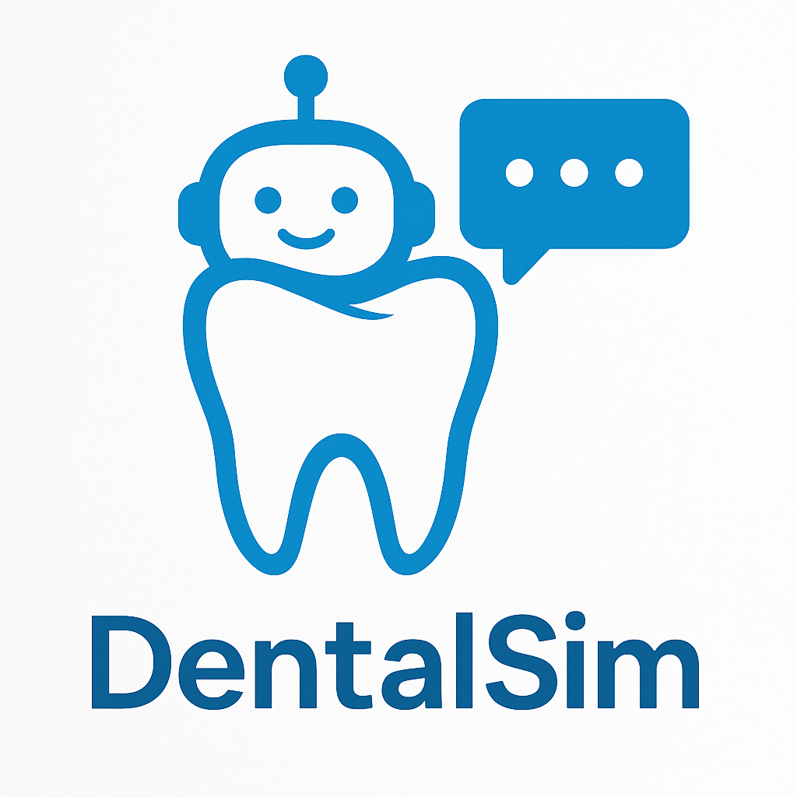
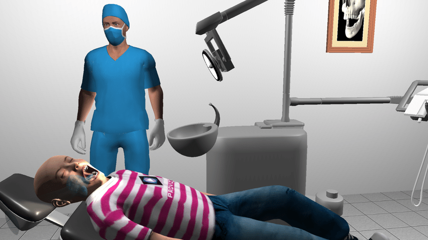
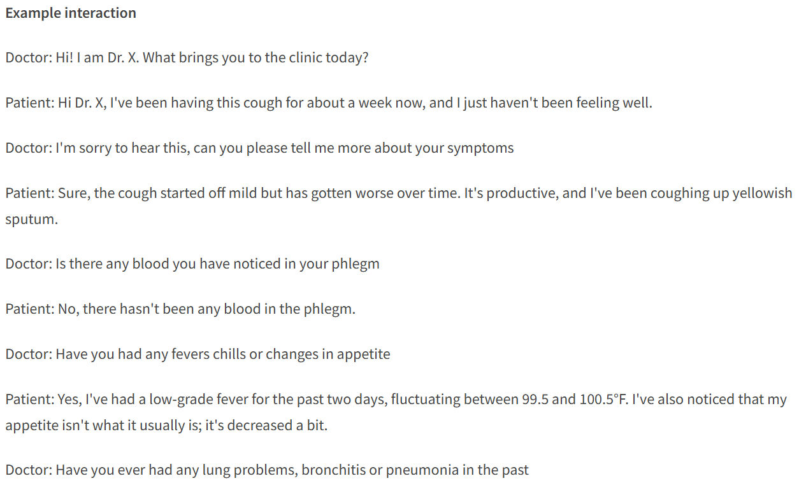
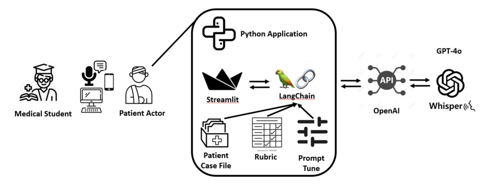
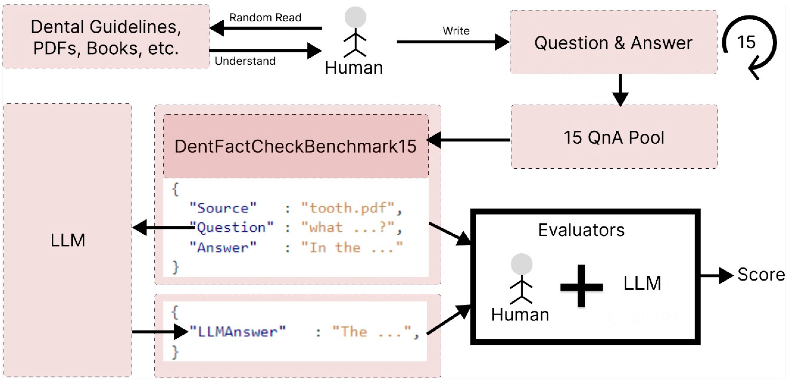

  

### Descrierea problemei
În procesul de formare a studenților la medicină dentară, nevoia de experiență practică cu pacienți reali este esențiala pentru dezvoltarea abilităților clinice și de comunicare. Accesul la pacienți reali este limitat, studenții nu pot exersa suficient scenarii variate, cum ar fi diferite tipuri de pacienți si diferite probleme de sănătate.
### Soluția propusă
Pentru a răspunde acestei nevoi, propunem ***DentalSim***, o aplicație inteligentă care utilizează modele de inteligență artificială de tip Large Language Model (LLM) pentru a simula pacienți virtuali realiști. Acești pacienți pot prezenta diferite simptome, comportamente, vârste și niveluri de cooperare, oferind studenților posibilitatea de a interacționa într-un mediu controlat și sigur, dar extrem de apropiat de realitate.

AI-ul rezolvă problema lipsei de expunere practică a studenților la cazuri clinice variate, oferind un mediu de simulare interactiv, unde aceștia pot învăța să diagnosticheze și să comunice eficient cu „pacienți” virtuali. Astfel, se reduce decalajul dintre pregătirea teoretică și practica medicală reală.

#### Funcționalități preliminare

Actori: Utilizator (exemplu: student la stomatologie), Pacient (LLM)

1) inițializare chat nou
2) interacțiune cu LLM-ul prin prompt-uri care sunt întrebări adresate pacientului
3) introducerea diagnosticului dedus de utilizator pentru evaluare și feedback

### Importanța proiectului
Simularea realistă a pacienților contribuie la creșterea nivelului de competență, la formarea empatiei și la îmbunătățirea capacității de luare a deciziilor în context clinic. Prin utilizarea AI, se pot genera un număr nelimitat de scenarii, adaptate nivelului de cunoștințe al fiecărui student, asigurând o învățare personalizată și eficientă.
### Utilizatori țintă
* Studenți la medicină dentară
* Instituții universitare care pot integra platforma în programele educaționale

### Datele utilizate
* **Date de intrare**: simptome dentare și comportamentul pacienților virtuali
* **Date de ieșire**: diagnostic, boala asociată simptomelor

Modelul AI primește ca input seturi de simptome și caracteristici ale pacientului, iar ca output generează dialoguri realiste.
Studentul este cel care, pe baza acestor interacțiuni, formulează diagnosticul final.

### Evaluarea performanței
* Realismul și coerența dialogului generat.
* Capacitatea de a răspunde consecvent în funcție de simptomele definite, respectând totodată caracteristicile pacientului simulat (vârstă, nivel de cooperare, ton emoțional, grad de anxietate etc.).
* Naturalețea interacțiunii simulate, evaluat prin feedback-ul studenților și al cadrelor didactice.

### Lucrări relevante
#### [Using a Virtual Patient via an Artificial Intelligence Chatbot to Develop Dental Students' Diagnostic Skills  ](https://pubmed.ncbi.nlm.nih.gov/35886584/)
#### [Artificial Intelligence Chatbots as Virtual Patients in Dental Education: A Constructivist Approach to Classroom Implementation](https://onlinelibrary.wiley.com/doi/full/10.1111/eje.13135?msockid=18534681691268e237c1520668d369f4)
În cadrul studiului au fost utilizate date calitative și cantitative provenite din simulări educaționale. Acestea au inclus observații de clasă, loguri de conversație dintre studenți și chatbotul AI, chestionare de uzabilitate și înregistrări privind consumul de resurse (tokeni și costuri GPT-4).  

Activitatea de tip AI role-play a simulat gestionarea unui pacient cu durere dentară, urmărind etapele reale ale unei consultații clinice. Studenții au realizat anamneza cu pacientul virtual, au sintetizat informațiile obținute, au propus și justificat teste de diagnostic, apoi au prezentat concluziile unui supervizor clinic AI. Acesta putea afișa rezultate reale sub formă de radiografii, fotografii și videoclipuri, permițând studenților să exerseze raționamentul clinic și interpretarea datelor într-un mediu virtual realist.  

Modelul de inteligență artificială folosit a fost ChatGPT-4, implementat într-o interfață web dezvoltată cu framework-ul open-source Streamlit. Sistemul a inclus două chatboturi interconectate care simulau interacțiunea dintre un pacient virtual și un supervizor clinic.

Performanțele au fost evaluate din perspectivă educațională și de uzabilitate. 86% dintre studenți au considerat experiența realistă și relevantă clinic, iar costurile au fost reduse (aproximativ 13,17 USD pentru 20 de interogări per 20 de studenți).

Cercetarea a utilizat tehnologii Python (Streamlit și API-ul OpenAI GPT-4), fără antrenare suplimentară a modelului. Autorii nu au publicat un repository GitHub sau codul sursă aferent abordării propuse.

#### [Virtual patient simulator for skill training in dentistry](https://cepdnaclk.github.io/e16-4yp-Virtual-Patient-Simulator-for-Skill-Training-in-Dentistry/Publications/Method_Research_Article.pdf)
În proiectul [Virtual Patient Simulator for Skill Training in Dentistry](https://github.com/cepdnaclk/e16-4yp-Virtual-Patient-Simulator-for-Skill-Training-in-Dentistry), sistemul a fost implementat ca o aplicație web care reproduce scenarii clinice specifice stomatologiei. Platforma folosește o interfață web dezvoltată în React și Redux pentru componenta de front-end, cu stocarea datelor în Firebase Firestore și distribuirea conținutului prin Firebase Cloud Storage. Vizualizarea tridimensională a cavității orale a fost realizată cu un model 3D creat în Blender și exportat în format .glb, integrat în interfață cu ajutorul bibliotecii react-three.js. Inițial, a fost analizată și opțiunea folosirii motorului Unity, însă a fost preferată soluția web pentru o redare mai clară și o compatibilitate sporită.

Din perspectivă funcțională, simulatorul a integrat simptome, comportamente simulate și istoricul pacientului pentru a reproduce un caz clinic complet. Deși în articol nu este menționată explicit folosirea unor algoritmi de inteligență artificială, sistemul se aliniază direcției actuale de utilizare a modelelor generative de limbaj și a algoritmilor comportamentali în simularea dialogului și a răspunsurilor pacientului virtual.

Rezultatele studiului au arătat o îmbunătățire semnificativă a abilităților de luare a deciziilor și a conștientizării situaționale la studenții care au utilizat simulatorul, comparativ cu cei instruiți prin metode tradiționale. De asemenea, platforma a fost apreciată pentru realismul interacțiunilor și utilitatea sa în pregătirea clinică.

  
  

#### [AI Patient Actor: An Open‑Access Generative‑AI App for Communication Training in Health Professions](https://geiselmed.dartmouth.edu/thesen/wp-content/uploads/sites/111/2024/12/Thesen-et-al-2024-AI-Patient-Actor-MSE.pdf)

Articole de presă: [1](https://home.dartmouth.edu/news/2024/01/geisel-professor-harnesses-ai-act-patient) 
                   [2](https://www.nhpr.org/health/2024-01-05/dartmouth-medical-school-ai-patient-app-interview-practice-chatgpt)

Acest proiect este un proiect asemănător cu ceea ce ne dorim noi să dezvoltăm dar este un pacient pentru studenții la medicină generală. Lucrarea este relevantă pentru DentalSim, deoarece demonstrează fezabilitatea utilizării modelelor LLM în educația medicală interactivă.

În cadrul proiectului *AI Patient Actor*, cercetătorii de la Dartmouth College au dezvoltat o aplicație web care permite studenților la medicină să exerseze abilitățile de comunicare și diagnostic prin interacțiuni cu pacienți virtuali generați de modele de inteligență artificială. Platforma oferă feedback formativ imediat, permițând studenților să-și corecteze răspunsurile și să-și îmbunătățească raționamentul clinic.

Aplicația utilizează modelul GPT-4o (OpenAI), un Large Language Model care generează răspunsuri contextuale și coerente în funcție de datele de intrare clinice introduse. Cazurile medicale (datele de intrare) sunt create manual de experți umani și includ simptome, semne, istoric medical și detalii psihosociale, fiind folosite ca seturi de constrângeri pentru comportamentul pacientului virtual. În acest mod, modelul nu inventează informații medicale, ci răspunde strict în baza fișei de caz definită, reducând riscul de erori sau biasuri.

  

Sistemul a fost implementat în Python 3.10, folosind framework-ul Streamlit (v1.27) pentru interfața web și biblioteca LangChain (v0.0.316) pentru procesarea prompturilor și gestionarea contextului conversațional. Interacțiunea cu modelul AI este realizată prin OpenAI API, iar suportul vocal este asigurat de Google Speech Recognition și OpenAI Whisper-3, oferind posibilitatea de utilizare atât în mod text, cât și vocal.

  

Aplicația este disponibilă online, dar codul sursă nu este publicat pe GitHub. 
Proiectul este în continuă dezvoltare fiind disponibilă și varianta din 2025 alături de articolul: [Generative AI as the First Patient: Practice, Feedback, and Confidence
](https://geiselmed.dartmouth.edu/thesen/wp-content/uploads/sites/111/2025/10/Thesen-et-al-2025-Generative-AI-as-the-first-patient-MSE.pdf)

#### [BERT-Based Medical Chatbot: Enhancing Healthcare Communication through Natural Language Understanding](https://www.sciencedirect.com/science/article/pii/S2667276624000143)

În acest studiu relevant din domeniu (+60 citări), autorii Arun Babu și Sekhar Babu Boddu propun un chatbot medical bazat pe arhitectura BERT (Bidirectional Encoder Representations from Transformers), conceput pentru a îmbunătăți comunicarea în domeniul medical prin înțelegerea limbajului natural. Lucrarea evidențiază modul în care modelele de tip transformer pot depăși limitările sistemelor tradiționale bazate pe reguli, asigurând o interpretare corectă a expresiilor medicale complexe și o interacțiune contextuală cu utilizatorul.

Pentru antrenarea modelului au fost utilizate seturi de date medicale extinse, precum MIMIC-III, BioASQ, PubMed și COVID-19 datasets, care conțin texte clinice, întrebări biomedicale și articole științifice. Sistemul a fost implementat în Python, folosind bibliotecile TensorFlow, spaCy și HuggingFace Transformers, cu simulări realizate pe GPU NVIDIA RTX 3090.

Modelul BERT a fost fine-tuned pe domeniul medical și integrat cu module de context management, intent recognition și dialogue generation, asigurând conversații coerente și precise. În evaluare, modelul a obținut 98% acuratețe, 97% precizie, 96% recall, 97% AUC-ROC și 98% F1-score, depășind modelele de referință LSTM, SVM și Bi-LSTM.

Lucrarea demonstrează potențialul ridicat al modelelor de tip transformer pentru conversații medicale sigure și personalizate. 
Este relevantă pentru proiectul DentalSim, deoarece abordează aceeași problemă de bază și anume crearea unei interacțiuni realiste și precise între utilizator și un pacient virtual dar într-un context clinic general, nu stomatologic.

#### [Dental Loop Chatbot: A Prototype Large Language Model Framework for Dentistry](https://www.mdpi.com/2674-113X/3/4/29)

Lucrarea propune un sistem conversațional bazat pe inteligență artificială dedicat stomatologiei. Chatbotul folosește modelul de limbaj LLaMA2, în variantele de 7B și 13B parametri, pentru a oferi răspunsuri la întrebări clinice în timp real. 

Modelul a fost fine-tuned cu date provenite din ghiduri clinice internaționale (ADA, BDA, SDCEP, IADT) utilizând tehnica Quantized Low-Rank Adaptation (QLoRA), care reduce consumul de memorie și permite antrenarea eficientă pe hardware limitat. Pentru **creșterea acurateței**, a fost adăugat un modul de Retrieval-Augmented Generation (RAG), care caută fragmente relevante dintr-o bază de cunoștințe vectorizată cu modelul all-mpnet-base-v2. 

  

Evaluarea pe setul DentFactCheckBenchmark15 a arătat că combinația QLoRA + RAG fine-tuned embeddings a obținut cel mai bun scor, 10/15 răspunsuri corecte. 

  

Implementarea a fost realizată în Python, folosind HuggingFace Transformers, Llama-Index și baze de date vectoriale. Codul este disponibil open-source pe GitHub: [Dental Loop Chatbot](https://github.com/faisalahmedsifat/Dental-Loop-Chatbot)

#### [Transforming undergraduate dental education: the impact of artificial intelligence](https://www.nature.com/articles/s41415-024-7788-7)

Lucrarea prezintă aplicații AI în educația dentară. Autorii descriu utilizarea machine learning și a rețelelor neuronale pentru analiza imaginilor radiografice, identificarea cariilor și a bolilor parodontale. 

În plus, menționează rolul procesării limbajului natural în dezvoltarea chatboturilor educaționale și în extragerea automată de informații din fișele medicale. Sunt discutate și alte tehnologii emergente, precum roboții haptici și simulatoarele VR, care pot antrena studenții prin feedback automat și simulări realiste. 

Lucrarea nu oferă o implementare practică, ci prezintă modelele și principiile AI relevante pentru viitorul educației medicale.

#### Articole relevante
Majoritatea chatbots sunt din perspectiva medicilor nu a pacientilor
[Top 5 Medical AI Chatbots in 2025](https://medical.chat-data.com/blog/top-5-medical-ai-chatbots-2025-healthcare)
